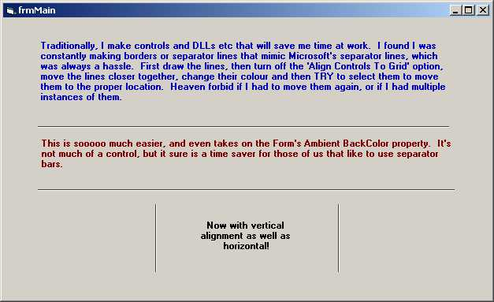



## ActiveLine

### Description

A real time saver for those of us that like to make use of Microsoft's separator bar / line. See Screen Shot for full desciption and visual.
 
### More Info
 

             |
---                |---
**Submitted On**   |2001-08-29 11:37:56
**By**             |[Austin K\. Hayward](https://github.com/Planet-Source-Code/PSCIndex/blob/master/ByAuthor/austin-k-hayward.md)
**Level**          |Advanced
**User Rating**    |4.8 (100 globes from 21 users)
**Compatibility**  |VB 5\.0, VB 6\.0
**Category**       |[Custom Controls/ Forms/  Menus](https://github.com/Planet-Source-Code/PSCIndex/blob/master/ByCategory/custom-controls-forms-menus__1-4.md)
**World**          |[Visual Basic](https://github.com/Planet-Source-Code/PSCIndex/blob/master/ByWorld/visual-basic.md)
**Archive File**   |[ActiveLine255418292001\.zip](https://github.com/Planet-Source-Code/austin-k-hayward-activeline__1-26775/archive/master.zip)

